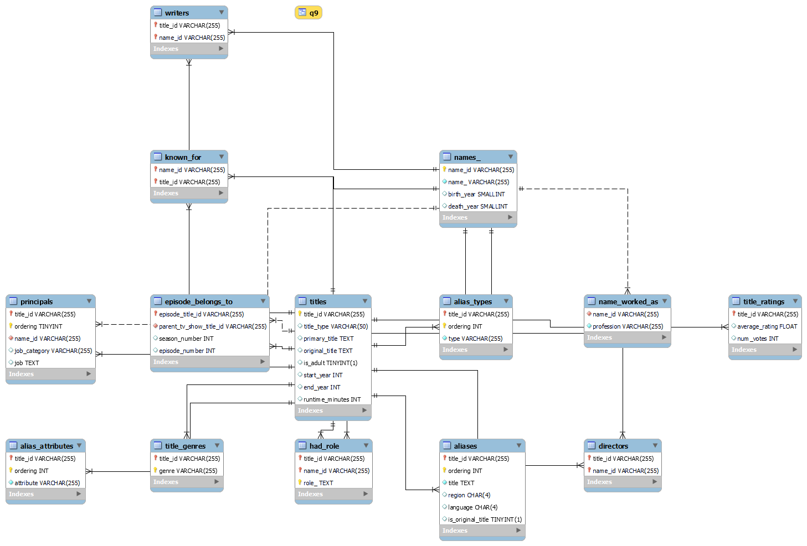

# imdb_daraset_RESTAPI_python
Provides REST APIs for the IMDB dataset

MySQL is used for storage purpose of the IMDB database. Other NoSQL database would be better choice in place of this considering the cases of searching using patterns.

Following is the image shows the ERD of the Database in my localhost.

